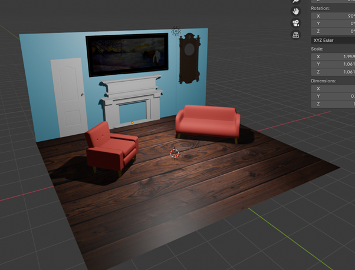

# Blender College Project: Interior Backdrop

This project was created as part of college coursework to demonstrate practical 3D modeling skills using Blender. The scene is a small interior backdrop featuring furniture, a fireplace, wall decorations, and flooring.

## Project Overview

- **Objective:** Create a visually appealing interior scene (backdrop) using Blender.  
- **Skills Demonstrated:**
  - 3D modeling of objects and furniture
  - Scene composition and layout
  - Materials and simple texturing
  - Lighting setup

## Screenshot Preview

## Notes

- File format: `.blend` (Blender project file)
- You need Blender to open and edit the scene
- Screenshots show the finished layout; lighting and material setup included
